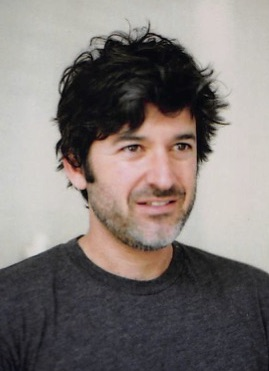

{::options parse_block_html="true" /}

DANIEL ROTHSCHILD  

I teach [philosophy](https://www.ucl.ac.uk/philosophy) at [University
College London](https://www.ucl.ac.uk/). Most of my work is about
language and meaning. You can also find links to a [website (in
progress) on dynamic semantics](http://dynsem.github.io/) and my
[cv](rothschildcv.pdf).

This site contains my papers and drafts and information on conferences,
workshops and such.

 

EVENTS

 
[{{page.title}}]( {{ page.url | prepend: site.baseurl }}), {{page.location}}, {{page.date}}
 

PAPERS BY SUBJECT  

DYNAMIC SEMANTICS

[Three Notions of Dynamicness in
Language](http://dx.doi.org/10.1007/s10988-016-9188-1){:.paper}
([penultimate draft](discourse-submitted.pdf))\\
(in *Linguistics and Philosophy*, 2016, with [Seth
Yalcin](http://yalcin.cc/))

[On the Dynamics of
Conversation](http://dx.doi.org/10.1111/nous.12121){:.paper}
([penultimate draft](dynamics.pdf))\\
(in *Noûs*, 2015 with [Seth Yalcin](http://yalcin.cc/))

PRESUPPOSITION

[Explaining Presupposition Projection with Dynamic
Semantics](rothschild-explaining.pdf){:.paper} (with some corrections,
2015)\\
(in [*Semantics and Pragmatics*](http://semprag.org/), 2011)

[Transparency Theory and its Dynamic Alternatives: Commentary on “Be
Articulate”](http://dx.doi.org/10.1515/THLI.2008.018){:.paper}
([penultimate draft](commentaryschlenker2.pdf))\\
(in *Theoretical Linguistics*, 2008)

[Presupposition Projection and Logical
Equivalence](http://dx.doi.org/10.1111%2fj.1520-8583.2008.00154.x){:.paper}
([penultimate draft](presuppositionequivalence.pdf))\\
(in *Philosophical Perspectives*, 2008)

TRUTHMAKERS

[Yablo's Semantic Machinery](yablo.pdf){:.paper}\\
(forthcoming in symposium on [Stephen
Yablo's](http://www.mit.edu/~yablo/home/Hello.html) *Aboutness* in
*Philosophical Studies*)

CONNECTIVES/CONDITIONALS

[A Puzzle about Knowing
Conditionals](http://dx.doi.org/10.1007/s11098-015-0553-7){:.paper}
([penultimate draft](knowingodds.pdf), [supplementary
note](supplement.html))\\
(forthcoming in *Noûs,* with [Levi
Spectre](http://www.openu.ac.il/Personal_sites/levi-spectre/))

[Conditionals and Propositions in
Semantics](http://dx.doi.org/10.1007/s10992-015-9359-5){:.paper}
([penultimate draft](conditionals.pdf))\\
(in *Journal of Philosophical Logic,* 2015)

[A Note on Conditionals and Restrictors](semconditionals.pdf){:.paper}
(2012)\\
(forthcoming in *Conditionals, Probability, and Paradox: Themes from the
Philosophy of Dorothy Edgington*, John Hawthorne and Lee Walters (eds.),
OUP)\\

[Capturing the Relationship Between Conditionals and Conditional
Probability with a Trivalent
Semantics](conditionalstrivalence2.pdf){:.paper} \\
(in *Journal of Applied Non-Classical Logics,* 2014)

[Connectives without Truth
Tables](http://dx.doi.org/10.1007/s11050-011-9079-5){:.paper}
([penultimate draft](connectives.pdf))\\
(with [Nathan
Klinedinst](http://www.ucl.ac.uk/psychlangsci/research/linguistics/People/linguistics-staff/n_klinedinst),
in *Natural Language Semantics*, 2012)

[Do Indicative Conditionals Express
Propositions?](http://dx.doi.org/10.1111/j.1468-0068.2010.00825.x){:.paper}
([penultimate draft](condprop2.pdf))\\
(in *Noûs*, 2011)

BELIEF

[Belief is Weak](http://dx.doi.org/10.1007/s11098-015-0553-7){:.paper}
([penultimate draft](belief.pdf))\\
(in *Philosophical Studies*, with [John
Hawthorne](https://dornsife.usc.edu/cf/phil/faculty_display.cfm?Person_ID=1047479)
and [Levi Spectre](http://www.openu.ac.il/Personal_sites/levi-spectre/))

QUESTIONS

[Worrying about Trivial
Questions](https://www.ucl.ac.uk/psychlangsci/research/linguistics/publications/wpl/12papers/rothschildUCLWPL){:.paper}\\
(in *UCL Working Papers in Linguistics,* 2013)

[Exhaustivity in Questions with
Non-Factives](http://dx.doi.org/10.3765/sp.4.2){:.paper}\\
(with [Nathan
Klinedinst](http://www.ucl.ac.uk/psychlangsci/research/linguistics/People/linguistics-staff/n_klinedinst),
in [*Semantics and Pragmatics*](http://semprag.org/), 2011)

POLARITY ITEMS

[Modularity and Intuitions in Formal Semantics: The Case of Polarity
Items](http://www.springerlink.com/content/4871042m16634812/){:.paper}
([penultimate draft](NPISI.pdf))\\
(with [Emmanuel Chemla](http://www.emmanuel.chemla.free.fr/) and
[Vincent Homer](https://sites.google.com/site/vincenthomer/), in
*Linguistics and Philosophy,* 2012)

[Non-Monotonic NPI-Licensing, Definite Descriptions, and Grammaticalized
Implicatures](http://ecommons.library.cornell.edu/handle/1813/7590){:.paper}\\
(in *Proceedings of SALT*, 2006)

DESCRIPTIONS

[The Elusive Scope of
Descriptions](http://dx.doi.org/10.1111/j.1747-9991.2007.00111.x){:.paper}
([penultimate draft](descriptions9-20.pdf))\\
(in *Philosophy Compass*, 2007)

[Presuppositions and
Scope](http://www.journalofphilosophy.org/articles/104/104-2.htm){:.paper}
([penultimate draft](p+s.pdf))\\
(in *The Journal of Philosophy*, 2007)

EXPRESSIVISM/SEMANTICS-PRAGMATICS\

[Expressing
Credences](http://onlinelibrary.wiley.com/doi/10.1111/j.1467-9264.2012.00327.x/abstract){:.paper}
([penultimate draft](expressingcredences.pdf))\\
(in *Proceedings of the Aristotelian Society*, 2012)

[Indexical
Predicates](http://dx.doi.org/10.1111/j.1468-0017.2009.01371.x){:.paper}
([penultimate draft](predind.pdf))\\
(with [Gabriel
Segal](http://www.kcl.ac.uk/artshums/depts/philosophy/people/staff/academic/segal/index.aspx),
in *Mind & Language*, 2009)

GAME THEORY AND PRAGMATICS

[Game Theory and Scalar
Implicatures](http://onlinelibrary.wiley.com/doi/10.1111/phpe.12024/abstract){:.paper}
([penultimate draft](GT+SI.pdf))\\
(in *Philosophical Perspectives*, 2013)

DRAFTS AND HANDOUTS

[Dynamic Conditionals](DynamicConditionals.pdf){:.paper} (2015, handout
on the dynamic test semantics for conditionals for a workshop on
conditionals in Osnabrük)

[Weak Belief and Pragmatics](wbp.pdf){:.paper} (2015, handout for a talk
at the UCL Pragmatics Reading Group)

[Fabian Truthmaking](FabianTruthmaking.pdf){:.paper} (2015, paper for
circulation at a symposium on themes from Yablo’s *Aboutness*)

[Quantified Epistemic Modality](birmingham.pdf){:.paper} (2015, handout
for Birmingham talk, joint work with Nathan Klinedinst)

[Epistemic Contradictions](epistemiccontradictions.pdf){:.paper} (2014,
handout)

[Two views of the de re](leeds.pdf){:.paper} (2014, handout for Leeds
talk)

Old draft of [Dynamics of Conversation](olddynamics.pdf){:.paper} (c.
2012, with Seth Yalcin)

[Making Dynamic Semantics Explanatory: Presupposition
Projection](dynamicexplanatory.pdf){:.paper} (2009, old draft, mostly
superseded by “Explaining Presupposition with Dynamic Semantics”)

[Grice, Utterance Choice, and Rationality](gricechoice5.pdf){:.paper}
(2008, parts superseded by “Game Theory and Scalar Implicatures”)

[Negative Polarity and Definite Descriptions](npidd.pdf){:.paper} (2006,
old manuscript)

